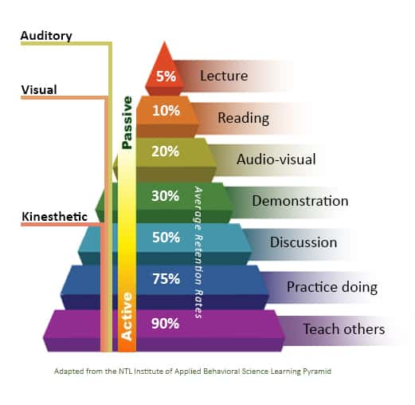

# **Hack The Box - Learning Process**

Learn how to "learn" with HackTheBox

### Section 1. The Mindset
#### 1.1. Way of Thinking.
We do not need to learn every programming language to understand how to read their code. All of them follow the same principles which R. D. Tennent initially defined:

- The Principle of Abstraction.
- The Principle of Correspondence.
- The Principle of Data Type Completeness.

#### 1.2. Occam's Razor.
- The most straightforward theory is preferable to all others of several sufficient possible explanations for the same state of facts. In other words: The simplest explanation is always the most probable.

-   **_" The art, after all, is not to get some flag but to find the way to do it._**

#### 1.3. Talent

No one is born talented but continuing learning leads us to the place where we are more acknowledged than yesterday, so keep learning, learning is a journey…

## Section 2. Learning Dependencies

#### 2.1. Way of Learning.

``` 
Q. 20 * ____ + _____ = 65535 
```

For the above-given equation multiple ways to solve it, so we should think outside the box. “Think Outside the Box”. We shouldn't limit our thoughts for a particular subject matter.

- A problem is an **emotional** state. Without emotions, it is just a **situation.**
- Know your goal

#### 2.2. Learning Efficiency. 

The primary and most difficult objective is to overcome it by combining our **knowledge**, **adaptation**, and **new information.**

Finding the information we need is often challenging. First, we have to determine what kind of information we need.

- What do we already know?
- What do we not know yet?

```
"What does it mean to be good?"
```

To be good at something means we know **what we are doing.** 

#### 2.3. Learning Types.



- There are two types of learning. That are:

    - **Pasive Learning**: If we follow the Learning Pyramid while going through the modules just by reading, we will learn only about **10%** of the whole penetration testing experience. By watching some demonstrations, we will not learn more than **30%.**

    - **Active Learning**: By discussing our entire enumeration process, results, and findings with others, we will see different points of view, results, and information to compare with our own and find out what we missed. That alone will add up to **50%** of the experience. While we practice, our learning experience grows up to **75%.**

- Progress is noticeable when the question that tortured us has lost its meaning.

#### 2.4. The Brain
Here are a few **myths** about the brain:

- We use only **5-10%** of our brainpower. 
- How **fast** we learn something says how **intelligent** we are.
- **Einstein**, who we know was **terrible at math** and learned very **slowly** throughout his school career, unlike the others.

*What Are Thoughts?*

- A thought is an **individual process** (action/reaction) to one or more **influences** (internal/external) in which information is **interpreted and linked** inwardly according to our **personal methodology** (developed through our existing lifetimes).

Conscious Thought

- **Consciousness** describes the totality of all those **mental processes** by which we become **aware** of the **external and our internal world** with **active observation.** Therefore, when we actively observe that we are looking at a monitor full of text and can decide to change the situation if necessary and **intentionally look** elsewhere, we are in consciousness.

Unconscious Thoughts

- Emotions **reflect** the way we think subconsciously.
- We process **far more thoughts** subconsciously than consciously.
- **Among other things**, the subconscious mind has **already made a decision 30 seconds** before we become **aware** of it.

``` 
Fun fact, most people do not even know that the brain regions responsible for the most difficult logical tasks do not develop until we're 20 (+/- 2) years old. 
```

#### 2.5. The Will

From a philosophical point of view, will is defined as **deciding** on a particular type of action based on the **motives** for acting consciously. So let us say will is the **effort** to perform a certain **action** or **achieve a specific goal.** Therefore, it is most relevant for us to have decided to achieve a goal that we have determined and strive for it.

Unfortunately, most people stop dreaming shortly after they start because they do not see a way to get there. These people overlook the essential component that **the path plays absolutely no role in how we reach that goal** because, ultimately, our path is only created by the steps we take.

```
But... What are fear?
```

- Fear is a **state and the product** of our **imagination** of the future and its consequences **where the present is suppressed.**

So let's ask if this fear is called for:

- Have we already worked through all the material?
- Have we already seen what is being taught and how it is being taught?
- Do we already have to have the skills that are expected of us?

If we answer "no" to these three questions, it should be clear that we are afraid of something without even trying it.

#### 2.6. The Goal

Over 90 percent of people are significantly more successful in achieving their dreams by setting **challenging and specific goals.** We cannot emphasize strongly enough the importance of setting a clear goal for ourselves.

What do we want to achieve? Do we want to...:

- Pass an exam?
- Obtain a certification?
- Learn and master new skills?
- Or impress and please others?

Because the decision of what goal we want to achieve influences how we learn, **a task or goal helps us influence how we think.**

An essential part of this is that by avoiding our own "thinking" (in the other word not trying to solve the task on our own), we deprive ourselves of the possibility of creating chains of associations in our brain. Thus, in simple terms, by avoiding our own "thinking" we deprive ourselves of the ability to learn something new and to develop further.

```
Just like a switch, efficiency WILL conflicts with comfort.
```

#### 2.7. Decision Making
